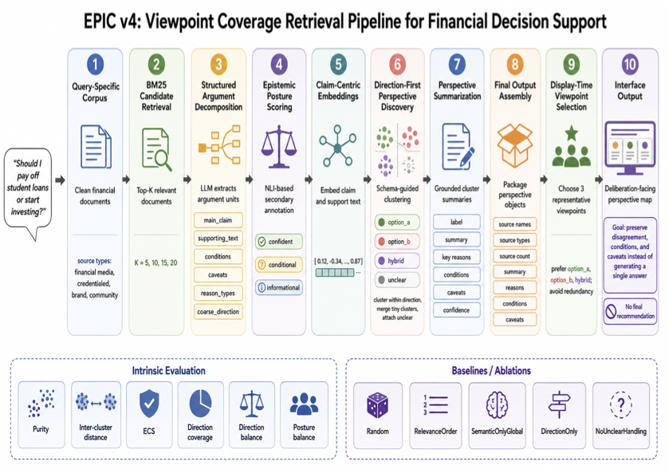

# Beyond Single-Answer RAG: Viewpoint Coverage Retrieval for Financial Decision Support

EPIC is a deliberation-oriented retrieval and interface pipeline for financial decision support. Instead of retrieving evidence and collapsing it into a single answer, EPIC retrieves candidate documents, decomposes them into structured argument units, discovers grounded perspective families, and presents viewpoint panels with source grounding, conditions, and caveats.

## Live app

- Streamlit demo: [epic-viewpoint-rag.streamlit.app](https://epic-viewpoint-rag-hagp5mrp6k2nkamogx83wn.streamlit.app/)
- Final report: [AdvancedIR_Spring26_ResearchProj.pdf](report/AdvancedIR_Spring26_ResearchProj.pdf)

## Pipeline overview



## Project motivation

Standard RAG systems are typically optimized for single-answer synthesis. That works well for factual questions, but it is a poor fit for many personal-finance decisions where multiple recommendations can be reasonable depending on interest rates, liquidity, tax treatment, risk tolerance, time horizon, and market conditions.

EPIC treats these cases as a viewpoint coverage retrieval problem rather than a single-answer generation problem. The goal is to surface the range of grounded perspectives in the evidence so that users can deliberate, not simply accept a system verdict.

## What EPIC does

EPIC v4 is a lightly supervised pipeline with five main ideas:

1. Retrieve a candidate pool with BM25 instead of processing the whole corpus uniformly.
2. Decompose retrieved documents into structured arguments with:
   - `main_claim`
   - `supporting_text`
   - `conditions`
   - `caveats`
   - `reason_types`
   - `coarse_direction`
3. Cluster arguments using direction-first perspective discovery.
4. Summarize clusters into grounded perspective panels.
5. Select a smaller set of representative viewpoints for interface display.

In the current implementation, EPIC is best understood as:

- structured argument discovery
- followed by viewpoint induction
- for a deliberation-facing RAG interface

## Supported decision queries

This repository contains prepared corpora and run artifacts for five financial decision scenarios:

1. Should I pay off student loans or start investing?
2. Should I contribute to a Roth IRA or a traditional 401k?
3. Should I build an emergency fund or pay down credit card debt first?
4. Is buying a home better than renting given current interest rates?
5. Should I invest in index funds or pay off my mortgage early?

## Main findings

The current EPIC v4 study evaluates five queries across four retrieval depths (`K = 5, 10, 15, 20`) plus additional larger runs for selected queries.

Key takeaways:

- Retrieval depth strongly shapes the epistemic landscape.
- Very small retrieval pools often miss important viewpoint families.
- Mid-range settings, especially `K = 15`, often provide the best balance between coverage and redundancy.
- EPIC consistently improves over random and relevance-order baselines.
- Semantic-only clustering remains a strong intrinsic baseline on some queries.
- The strongest EPIC behavior appears on queries with naturally separable stance families.

## Repository contents

- `app/`
  - `streamlit_app.py`
    - Streamlit interface for browsing the final perspective panels

- `pipeline/`
  - `epistemic_rag_v4_pipeline.ipynb`
    - Main generalized EPIC v4 notebook

- `data/raw_documents/`
  - `q1_corpus_final.xlsx`
    - Original mixed workbook collected during corpus building

- `data/prepared_corpora/`
  - `q1_corpus_prepared.xlsx`
  - `q2_corpus_prepared.xlsx`
  - `q3_corpus_prepared.xlsx`
  - `q4_corpus_prepared.xlsx`
  - `q5_corpus_prepared.xlsx`
  - `team_corpus_normalized_master.xlsx`
  - `normalization_qa_summary.md`
  - `normalization_qa_summary.json`
    - Cleaned, normalized, and query-split corpora used by EPIC v4

- `runs/`
  - Saved outputs for all included EPIC runs
  - Each run directory contains artifacts such as:
    - `retrieved_docs.json`
    - `structured_arguments.json`
    - `structured_scored.json`
    - `arguments_indexed.json`
    - `claim_embeddings.npy`
    - `support_embeddings.npy`
    - `perspective_clusters.json`
    - `perspective_summaries.json`
    - `final_output.json`
    - `main_viewpoints.json`
    - `evaluation.json`
    - `step_times.json`

## Report-highlighted runs

Although the repository includes all saved runs, the write-up primarily highlights:

- `q1_topk15`
- `q2_topk15`
- `q3_topk15`
- `q4_topk20`
- `q5_topk15`

These were the most representative qualitative runs used in the report and interface examples.

## Running the app locally

From the repository root:

```bash
pip install -r requirements.txt
streamlit run app/streamlit_app.py
```

The app only reads saved run artifacts. It does not need to rerun the full EPIC pipeline to display results.

## Running the pipeline

The main notebook is:

- `pipeline/epistemic_rag_v4_pipeline.ipynb`

The notebook now supports both:

- the original project layout
- this repository layout

It expects:

- prepared corpora under `data/prepared_corpora/`
- run artifacts under `runs/`
- an `OPENAI_API_KEY` in your environment or `.env` file if you want to rerun extraction or summarization steps

## Deployment

This repository is configured for Streamlit Community Cloud:

- main file path: `app/streamlit_app.py`
- dependency file: `requirements.txt`

## Notes

- The app is a grounded interface over saved pipeline outputs, not a live agent that recomputes EPIC on demand.
- The current evaluation is primarily intrinsic plus qualitative inspection of final viewpoint panels.
- EPIC is lightly supervised through a query-relative directional scaffold (`option_a`, `option_b`, `hybrid`, `unclear`) rather than fully unsupervised viewpoint discovery.
